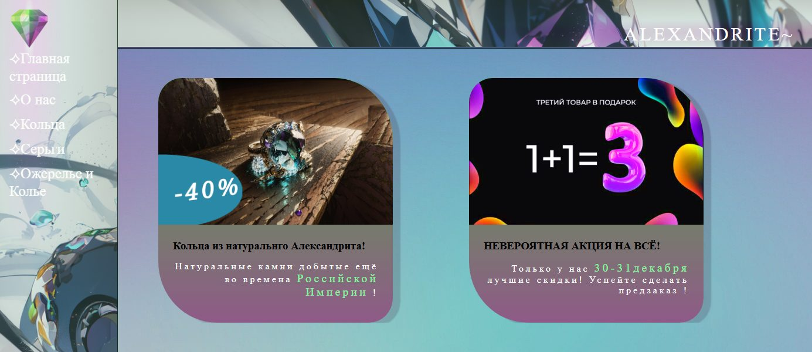

# Alexandrite: Jewelry Store Website

A multi-page static website for a fictional jewelry store, **Alexandrite**, built with plain HTML and CSS as one of my first web projects (2024).

## Pages

| Page | File |
|---|---|
| Home: promo cards and sales | `html/uvilirka.html` |
| About us | `html/uvilirka_o_nas.html` |
| Rings | `html/uvilirka_kolechki.html` |
| Earrings | `html/uvilirka_sergi.html` |
| Necklaces | `html/uvilirka_kolie.html` |

## Features

- Sidebar navigation shared by all pages
- Product and promo cards with rounded image frames, discount badges and shadows
- Background images and custom typography
- `html/инструкция.txt`: my own HTML/CSS cheat sheet written while building the site

## How to run

No build step: open `html/uvilirka.html` in a browser.

## Tech stack

HTML5 · CSS3

## License

[MIT](LICENSE)
